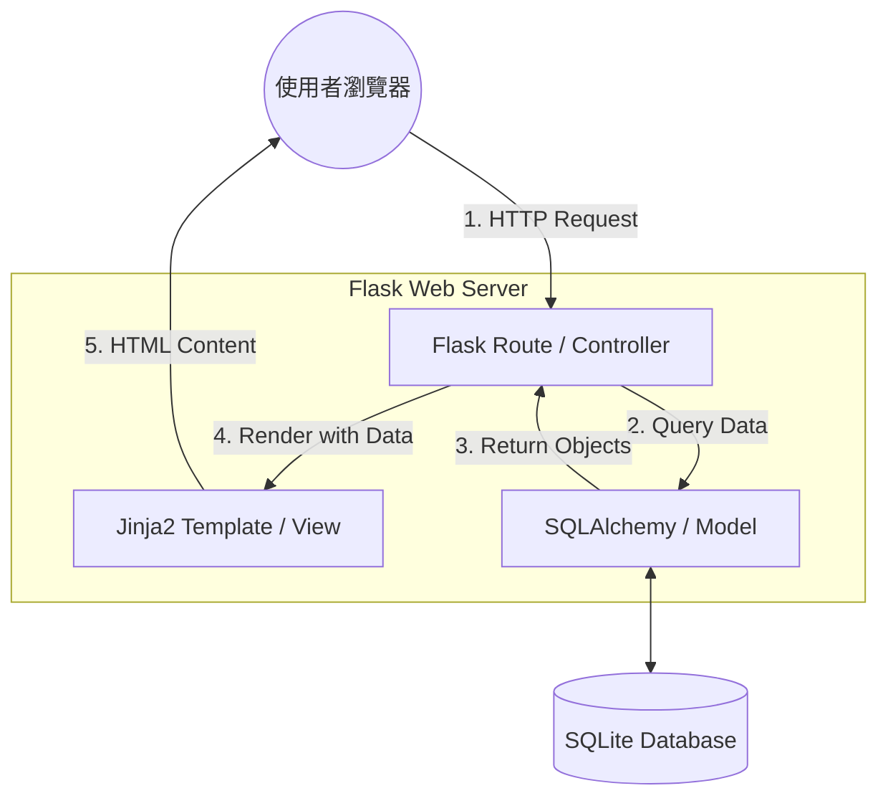

# 系統架構設計 (System Architecture) - 食譜收藏系統

本文件根據 [PRD.md](file:///c:/Users/User/Desktop/web_app_development/docs/PRD.md) 的需求，規劃「食譜收藏系統」的技術架構、資料夾結構與元件職責。

---

## 1. 技術架構說明

本系統採用 **Flask MVC (Model-View-Controller)** 模式進行開發，確保程式碼結構清晰且易於維護。

### 選用技術與原因
- **後端 (Controller/Logic)**: Python + Flask
  - 原因：輕量級、開發速度快，適合個人專案或 MVP 實作。
- **模板引擎 (View)**: Jinja2
  - 原因：Flask 內建支援，直接在後端渲染 HTML 頁面，不需額外的前端框架（如 React/Vue），簡化部署。
- **資料庫 (Model)**: SQLite + SQLAlchemy
  - 原因：SQLite 不需要額外安裝資料庫伺服器，單一檔案即可儲存，非常適合單人使用的食譜系統。SQLAlchemy 則提供 ORM 功能，讓資料庫操作更安全、直覺。

### MVC 職責分配
- **Model (模型)**: 定義食譜、食材、日曆排程等資料表結構，負責與 SQLite 進行資料互動。
- **View (視圖)**: 使用 Jinja2 模板產出的 HTML/CSS 頁面，負責將資料視覺化呈現給使用者。
- **Controller (路由與邏輯)**: Flask 的路由處理函式，負責接收使用者請求、呼叫 Model 取得資料、並決定回傳哪個 View。

---

## 2. 專案資料夾結構

建議的資料夾結構如下，遵循 Flask 的最佳實務：

```text
web_app_development/
├── app/                  # 應用程式核心程式碼
│   ├── models/           # 資料庫模型 (Models) - 定義食譜、食材等
│   │   └── __init__.py
│   ├── routes/           # Flask 路由 (Controllers) - 處理請求邏輯
│   │   ├── __init__.py
│   │   ├── main.py       # 首頁、搜尋
│   │   ├── recipe.py     # 食譜新增/編輯/刪除
│   │   └── calendar.py   # 烹飪日曆邏輯
│   ├── templates/        # Jinja2 HTML 模板 (Views)
│   │   ├── base.html     # 共用佈局 (Navbar, Footer)
│   │   ├── index.html    # 首頁 (食譜列表)
│   │   ├── recipe.html   # 食譜詳情與編輯
│   │   └── calendar.html # 日曆頁面
│   ├── static/           # 靜態資源
│   │   ├── css/          # 樣式表
│   │   ├── js/           # 客戶端指令碼 (如：動態增減食材列)
│   │   └── uploads/      # 食譜照片上傳路徑
│   └── __init__.py       # App 初始化 (Factory Pattern)
├── instance/             # 私有設定與資料庫檔案
│   └── database.db       # SQLite 資料庫主檔案
├── docs/                 # 專案文件 (PRD, Architecture)
├── app.py                # 進入點 (Entry Point)
├── config.py             # 系統設定項 (Secret Key, DB URI)
├── requirements.txt      # 依賴套件清單
└── README.md
```

---

## 3. 元件關係圖

以下展示使用者請求在系統中流轉的過程：



---

## 4. 關鍵設計決策

1.  **採用 SQLite (而非 MySQL/PostgreSQL)**:
    - 考量到這是個人工具，SQLite 的「零配置」與「單檔案」特性讓搬移或備份變得很簡單，效能足夠應付數千篇食譜。
2.  **Server-side Rendering (Jinja2)**:
    - 為了快速交付 MVP，選擇不進行前後端分離，避免跨域請求 (CORS) 與複雜的狀態管理，直接產出已完成的頁面。
3.  **SQLAlchemy ORM**:
    - 使用 ORM 而非純 SQL 指令，主要是為了開發效率以及降低 SQL Injection 風險，且未來若需遷移到其他資料庫也會更容易。
4.  **Factory Pattern 初始化**:
    - 在 `app/__init__.py` 使用 `create_app()`，這有利於之後撰寫單元測試 (Unit Test) 與擴充功能，是目前推薦的 Flask 組織方式。

---

## 5. 後續實作順序

1.  **Flowchart**: 繪製使用者操作流程。
2.  **DB Design**: 定義詳細的資料表 Schema。
3.  **API/Route Design**: 規劃具體的 URL 路徑與 HTTP Method。
4.  **Implementation**: 開始撰寫程式碼。
