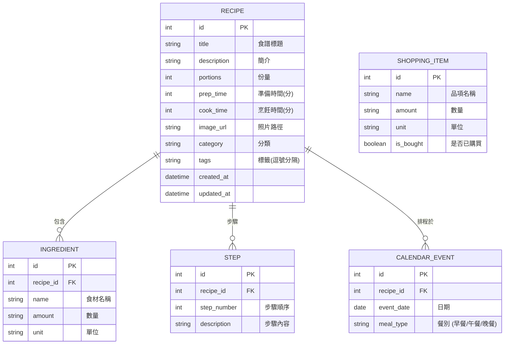

# 資料庫設計 (Database Design) - 食譜收藏系統

本文件定義了「食譜收藏系統」的資料庫結構，採用 SQLite，並使用 SQLAlchemy ORM 進行實作。

---

## 1. ER 圖 (Entity Relationship Diagram)



---

## 2. 資料表詳細說明

### 2.1 RECIPE (食譜)
儲存食譜的核心資訊。
- `id`: 主鍵，自動遞增。
- `title`: 必填，食譜名稱。
- `category`: 分類（如：中式、日式、甜點）。
- `tags`: 關鍵字標籤，用於進階搜尋。

### 2.2 INGREDIENT (食材)
關聯到特定食譜。
- `recipe_id`: 外鍵，關聯至 RECIPE。
- `name`: 食材名稱。
- `amount` & `unit`: 存儲數量（如：1, 100）與單位（如：個, 克）。

### 2.3 STEP (步驟)
關聯到特定食譜的烹飪指令。
- `step_number`: 排序用。
- `description`: 詳細作法文字。

### 2.4 CALENDAR_EVENT (日曆排程)
儲存哪一天要做哪道料理。
- `event_date`: 日期（ISO 格式）。
- `meal_type`: 字串，限定為 'breakfast', 'lunch', 'dinner' 等。

### 2.5 SHOPPING_ITEM (購物項目)
由食譜生成或手動新增的待買清單。
- `is_bought`: 布林值，預設為 False。

---

## 3. SQL 建表語法 (database/schema.sql)

```sql
-- 食譜主表
CREATE TABLE IF NOT EXISTS recipes (
    id INTEGER PRIMARY KEY AUTOINCREMENT,
    title TEXT NOT NULL,
    description TEXT,
    portions INTEGER,
    prep_time INTEGER,
    cook_time INTEGER,
    image_url TEXT,
    category TEXT,
    tags TEXT,
    created_at DATETIME DEFAULT CURRENT_TIMESTAMP,
    updated_at DATETIME DEFAULT CURRENT_TIMESTAMP
);

-- 食材表
CREATE TABLE IF NOT EXISTS ingredients (
    id INTEGER PRIMARY KEY AUTOINCREMENT,
    recipe_id INTEGER NOT NULL,
    name TEXT NOT NULL,
    amount TEXT,
    unit TEXT,
    FOREIGN KEY (recipe_id) REFERENCES recipes (id) ON DELETE CASCADE
);

-- 步驟表
CREATE TABLE IF NOT EXISTS steps (
    id INTEGER PRIMARY KEY AUTOINCREMENT,
    recipe_id INTEGER NOT NULL,
    step_number INTEGER NOT NULL,
    description TEXT NOT NULL,
    FOREIGN KEY (recipe_id) REFERENCES recipes (id) ON DELETE CASCADE
);

-- 日曆排程表
CREATE TABLE IF NOT EXISTS calendar_events (
    id INTEGER PRIMARY KEY AUTOINCREMENT,
    recipe_id INTEGER NOT NULL,
    event_date TEXT NOT NULL,
    meal_type TEXT,
    FOREIGN KEY (recipe_id) REFERENCES recipes (id) ON DELETE CASCADE
);

-- 購物清單表
CREATE TABLE IF NOT EXISTS shopping_items (
    id INTEGER PRIMARY KEY AUTOINCREMENT,
    name TEXT NOT NULL,
    amount TEXT,
    unit TEXT,
    is_bought BOOLEAN DEFAULT 0
);
```
