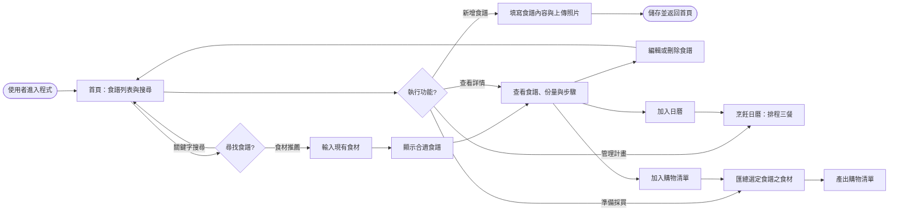
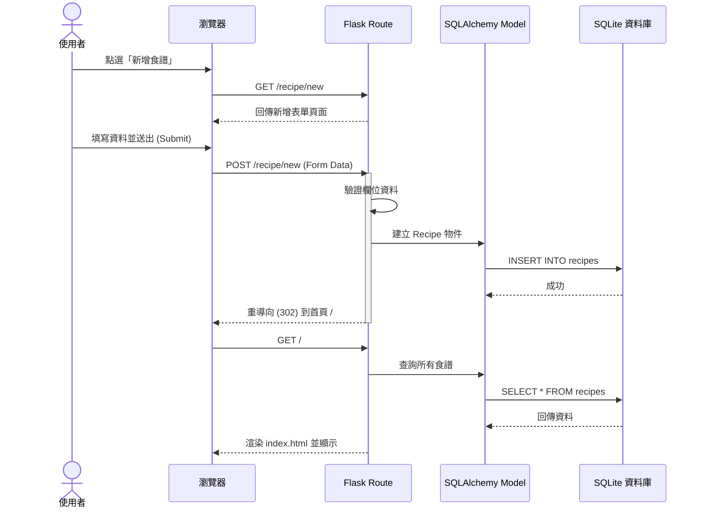

# 流程圖設計 (Flowchart) - 食譜收藏系統

本文件根據 [PRD.md](file:///c:/Users/User/Desktop/web_app_development/docs/PRD.md) 與 [ARCHITECTURE.md](file:///c:/Users/User/Desktop/web_app_development/docs/ARCHITECTURE.md) 的定義，視覺化使用者操作路徑與系統資料處理流程。

---

## 1. 使用者流程圖 (User Flow)

描述使用者進入系統後的主要操作路徑：

---

## 2. 系統序列圖 (Sequence Diagram)

以「新增食譜」為例，描述資料在系統內部的流動過程：

---

## 3. 功能清單對照表

規劃系統的主要路由網址與對應之 HTTP 方法：

| 功能模組 | URL 路徑 | HTTP 方法 | 說明 |
| :--- | :--- | :--- | :--- |
| **首頁/搜尋** | `/` | `GET` | 顯示所有食譜列表，支援 query string 搜尋 |
| **新增食譜** | `/recipe/new` | `GET`, `POST` | 顯示表單與處理資料提交 |
| **食譜詳情** | `/recipe/<int:id>` | `GET` | 查看單一食譜完整內容 |
| **編輯食譜** | `/recipe/<int:id>/edit` | `GET`, `POST` | 編輯現有食譜內容 |
| **刪除食譜** | `/recipe/<int:id>/delete` | `POST` | 刪除指定食譜 |
| **食材推薦** | `/recommend` | `GET` | 根據輸入食材進行標籤/關鍵字篩選 |
| **烹飪日曆** | `/calendar` | `GET` | 顯示本週/本月排程 |
| **排程操作** | `/calendar/add` | `POST` | 將指定食譜加入特定日期 |
| **購物清單** | `/shopping-list` | `GET` | 匯總已加入清單的食譜食材 |

---

## 4. 設計備註

- **推薦邏輯**：初步採用標籤 (Tag) 或關鍵字模糊比對，若多項食材符合則排序在前。
- **購物清單**：系統應能自動過濾重複食材，未來可考慮加入「份量自動加總」功能。
- **靜態資源**：所有的 CSS 與 Vanilla JS 將存放在 `/static` 資料夾，減少請求外部 CDN 以確保離線可用性。
